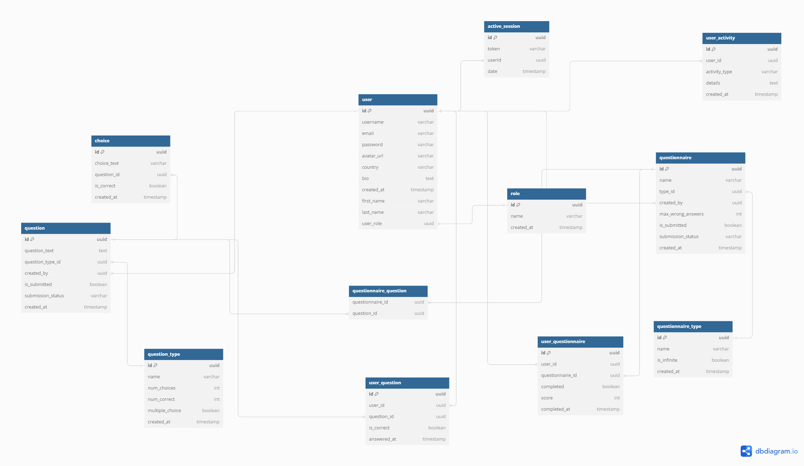

### YO ! Let's get started :)

### DB Diagram as it stands now

https://dbdiagram.io/d/medical_exam-66a6e74a8b4bb5230e934a92

### Installing Docker on Windows

## Official Docker Installation Guide

> Follow the official Docker installation guide for Windows to install Docker Desktop on your Windows machine.

https://docs.docker.com/desktop/install/windows-install/

### WSDL Explanation
WSDL (Web Services Description Language) is an XML-based language used for describing the functionality offered by a web service. WSDL is important because it:

- Provides a detailed description of web services and their operations, messages, and binding information.
- Facilitates the automation of web service communication, making it easier to integrate and interact with different services.

Follow instructions here: https://docs.docker.com/desktop/wsl/
### Installing Docker Compose

Docker Compose comes pre-installed with Docker Desktop for Windows. Ensure Docker Compose is installed by running:

````sh
 docker-compose --version
````

### Installing PostgreSQL with Docker Compose

There is a docker-compose.yml file in the devops folder at the root of your project:
 
````yml
version: '3.8'
services:
  db:
    image: postgres:latest
    environment:
      POSTGRES_USER: your_username
      POSTGRES_PASSWORD: your_password
      POSTGRES_DB: your_database
    ports:
      - "5432:5432"
    volumes:
      - postgres_data:/var/lib/postgresql/data

volumes:
  postgres_data:
````

Replace your_username, your_password, and your_database with your desired credentials.

#### Using DBeaver as a PostgreSQL Client

[DBeaver](https://dbeaver.io/) is a recommended PostgreSQL client. Download and install DBeaver to manage your PostgreSQL database with a user-friendly interface.

### Node.js and NVM Installation on Windows

#### Installing NVM

````sh
 nvm --version

````

#### Installing Node.js with NVM

Install and use a specific version of Node.js:

````sh
nvm install 18.0.0
nvm use 18.0.0
````

Replace 18.0.0 with the version you need.

#### Switching Between Node.js Versions

To switch between installed Node.js versions:


````sh
nvm use 16.13.0

````

#### Verifying Installed Versions

Check your installed versions:

````yml
 node -v
 npm -v
 yarn -v
````

Your versions are:

- npm: 10.2.3
- yarn: 1.22.21

### Installing Yarn Globally

Install Yarn globally using npm:

````yml
npm install -g yarn

````

### Installing Project Dependencies with Yarn

Install the project dependencies by navigating to your project directory and running:

```sh
yarn install
```

### Setting Up the .env File

Create a `.env` file in the root of your project and set the credentials from docker-compose.yml:

````env
NODE_ENV=PROD
PORT=5000
SECRET=863B8107F2C9E2C5BE4489s688F55F542FF0EB5AasdA16616D12665DB0684A1

POSTGRES_HOST=localhost
POSTGRES_PORT=5432
POSTGRES_USER=your_username
POSTGRES_PASSWORD=your_password
POSTGRES_DB=medical_exam

````

Replace your_username, your_password, and POSTGRES_DB with your actual credentials.

### Understanding the package.json File

## General Info

The package.json file contains metadata about your project, including dependencies and scripts.

#### Dependencies

- Production Dependencies: Libraries required for your application to run.
- DevDependencies: Libraries required for development and testing.

#### Scripts

- **start-pm2**: Starts the application using PM2 with a configuration file.
- **start-no-daemon**: Starts PM2 without running as a daemon.
- **start**-node: Starts the application using Node.js.
- **dev**: Runs the application in development mode with TypeScript and Node.js.
- **test**: Runs tests using Jest.
- **lint**: Lints the codebase using ESLint.
- **build**: Builds the project using TypeScript compiler.
- **typeorm**: Runs TypeORM CLI commands.

#### Database Connectivity Configuration

Database configuration can be found in the TypeORM configuration:

````json
{
  "name": "default",
  "type": "postgres",
  "host": "localhost",
  "port": 5432,
  "username": "c4t",
  "password": "c4t",
  "database": "medical_exam",
  "synchronize": true,
  "logging": false,
  "entities": ["src/models/**/*.ts"],
  "migrations": ["src/migrations/**/*.ts"],
  "cli": {
    "migrationsDir": "src/migrations/"
  }
}

````

### Running Migrations

Run database migrations using TypeORM:

```ssh
yarn typeorm migration:run
```

### Configuring PhpStorm to Run the Development Script

1. Open PhpStorm and go to Run > Edit Configurations.
2. Add a new Node.js configuration.
3. Set the script to yarn dev and save the configuration.

#### Building and Running the Project

To build the project:

````sh
yarn build
````

To run the built project:

````sh
node build/index.js
````

#### Seeding the project

Just run 


````sh
    yarn seed
````

and the database will have some basic information seeded.

### This here is the dbdiagram syntax for the database

````dbdiagram
    Table role {
  id uuid [pk]
  name varchar
  created_at timestamp [default: `now()`]
}

Table user {
  id uuid [pk]
  username varchar
  email varchar [unique]
  password varchar
  avatar_url varchar [null]
  country varchar [null]
  bio text [null]
  created_at timestamp [default: `now()`]
  first_name varchar
  last_name varchar
  user_role uuid
}

Table active_session {
  id uuid [pk]
  token varchar
  userId uuid
  date timestamp [default: `now()`]
}

Table question_type {
  id uuid [pk]
  name varchar
  num_choices int
  num_correct int
  multiple_choice boolean
  created_at timestamp [default: `now()`]
}

Table question {
  id uuid [pk]
  question_text text
  question_type_id uuid
  created_by uuid
  is_submitted boolean [default: false]
  submission_status varchar [default: `pending`]
  created_at timestamp [default: `now()`]
}

Table choice {
  id uuid [pk]
  choice_text varchar
  question_id uuid
  is_correct boolean
  created_at timestamp [default: `now()`]
}

Table questionnaire_type {
  id uuid [pk]
  name varchar
  is_infinite boolean
  created_at timestamp [default: `now()`]
}

Table questionnaire {
  id uuid [pk]
  name varchar
  type_id uuid
  created_by uuid
  max_wrong_answers int
  is_submitted boolean [default: false]
  submission_status varchar [default: `pending`]
  created_at timestamp [default: `now()`]
}

Table questionnaire_question {
  questionnaire_id uuid
  question_id uuid
}

Table user_activity {
  id uuid [pk]
  user_id uuid
  activity_type varchar
  details text
  created_at timestamp [default: `now()`]
}

Table user_questionnaire {
  id uuid [pk]
  user_id uuid
  questionnaire_id uuid
  completed boolean [default: false]
  score int
  completed_at timestamp [default: `now()`]
}

Table user_question {
  id uuid [pk]
  user_id uuid
  question_id uuid
  is_correct boolean
  answered_at timestamp [default: `now()`]
}

Ref: user.user_role > role.id
Ref: active_session.userId > user.id
Ref: question.question_type_id > question_type.id
Ref: question.created_by > user.id
Ref: choice.question_id > question.id
Ref: questionnaire.type_id > questionnaire_type.id
Ref: questionnaire.created_by > user.id
Ref: questionnaire_question.questionnaire_id > questionnaire.id
Ref: questionnaire_question.question_id > question.id
Ref: user_activity.user_id > user.id
Ref: user_questionnaire.user_id > user.id
Ref: user_questionnaire.questionnaire_id > questionnaire.id
Ref: user_question.user_id > user.id
Ref: user_question.question_id > question.id

````




### Folder structure

[folder-structure.txt](folder-structure.txt)